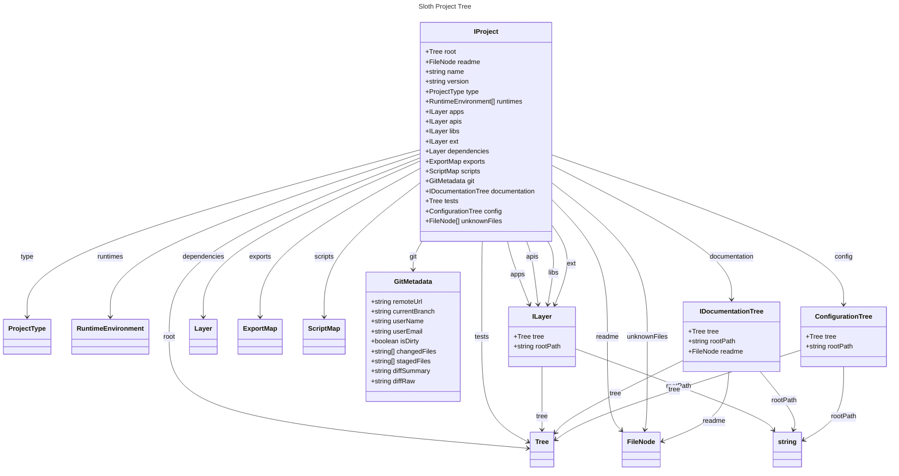

# 📊 Diagrammes

Vous pouvez ajouter vos propres règles pour détecter des rôles ou des tags personnalisés.

## Diagramme de classes



## Définition des classes principales et des classes associées

```mermaid

```
